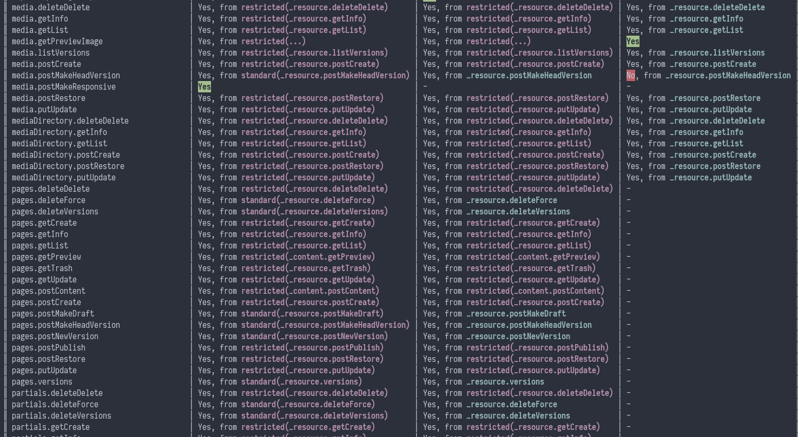

# Oxygen - Auth

This repository contains Oxygen's authorisation component.

For more information visit the [Core](https://github.com/oxygen-cms/core) repository.

## Two-Factor Authentication

Through a [Doctrine port of the laraguard](https://github.com/oxygen-cms/laraguard-doctrine) package.

Uses an authenticator app instead of SMS.

## User Impersonation

Provided through the [laravel-impersonate](https://github.com/404labfr/laravel-impersonate) package.

## Permissions system

This package features a powerful permissions system, in which groups
inherit permissions from their parent group, and also more specific
permissions can inherit from more abstract permissions. For example,
permissions for "pages" could inherit from a more abstract "_resource" psuedo content type.

The following excerpt of the command line interface (`artisan permissions`) demonstrates some of the features:

